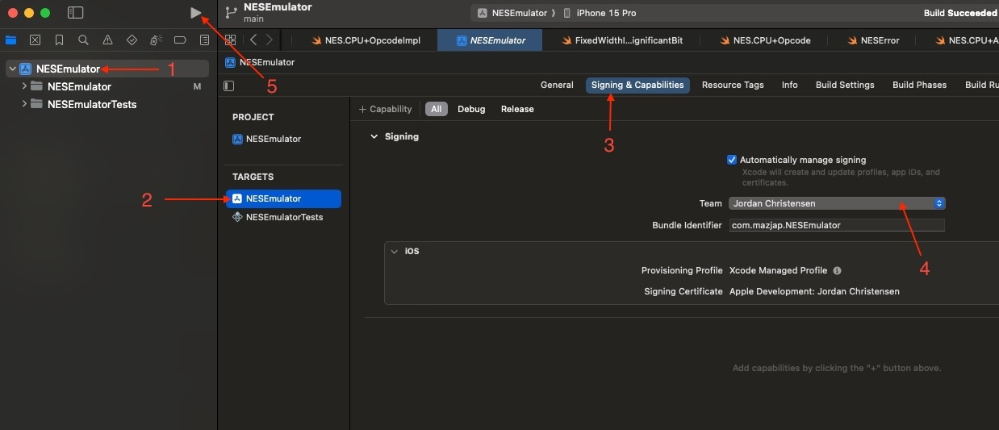

# SwiftNES

A Nintendo Entertainment System (NES) emulator written in Swift. The goal of this project is to deepen my understanding of system architecture, assembly language, and the inner workings of the NES by accurately replicating its functionality.

## Build and Run Instructions

To build and run the emulator, follow these steps:

1. **Clone the repository:**

   `git clone https://github.com/mazjap/SwiftNES.git`

3. **Navigate to the project directory:**

   `cd ./SwiftNES`

4. **Open the project with Xcode:**

   `open ./NESEmulator.xcodeproj`

5. **Change the Team used to sign the project:**

   

6. **Change the run destination and run the project:**
   
   Keyboard shortcut: `command+r`

   OR
   
   Play icon in the top left of Xcode

Please ensure that you have Swift installed on your machine. This project uses Swift 5, and it's recommended to use the same version or newer.

## Current State of the Project

The following features are currently implemented:

- Basic CPU emulation (MOS 6502)
- Basic memory management unit (MMU)

### Missing Features

The emulator is still in development, and several key components are not yet implemented:

- Some opcode implmentations
- Picture Processing Unit (PPU) for graphics rendering
- Audio Processing Unit (APU) for sound
- Support for multiple cartridge mappers
- Additional debugging tools

## Contributing

Please note that this is a personal project designed for educational purposes, and as such, contributions are not currently being accepted. However, any feedback or suggestions are welcome!

## License

This project is released under the MIT License. See the `LICENSE` file for more information.

## Acknowledgments

Thanks to the people behind these projects for their extensive documentation:

  1. [NESDev](https://www.nesdev.org/)
  2. [Masswerk](https://www.masswerk.at/nowgobang/2021/6502-illegal-opcodes)
  3. [Emulator101](http://www.emulator101.com/6502-addressing-modes.html)
  4. [Cdot Wiki](https://wiki.cdot.senecapolytechnic.ca/wiki/6502_Addressing_Modes)

And many more
